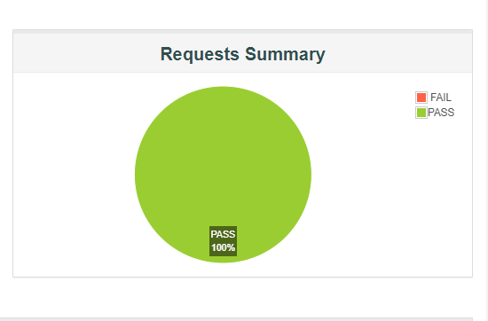

# Load testing Report

| Concurrent Request  | Loop Count | Avg TPS for Total Samples  | Error Rate | Total Concurrent API request |
|               :---: |      :---: |                      :---: |                        :---: |      :---: |
| 100  | 1  |  119  | 0%     | 300   |
| 200  | 1  |  294  | 0%     | 600   |
| 400  | 1  |  700  | 0.0%   | 1200  |
| 500  | 1  |  255  | 0.0%   | 1500  |

### Summary
- Server can handle almost concurrent 500 API call with almost zero (0) error rate.


# Introduction

This document explains how to run a performance test with JMeter against an test App.Test executed for restful-booker.herokuapp.com

# Install

**Java**  
https://www.oracle.com/java/technologies/downloads/

**JMeter**  
https://jmeter.apache.org/download_jmeter.cgi  

Click =>Binaries    
=>**apache-jmeter-5.5.zip**

# Prerequisites
- As of JMeter 4.0, Java 8 and above are supported.
- we suggest  multicore cpus with 4 or more cores.
- Memory 16GB RAM is a good value.

# Elements of a minimal test plan
- Thread Group

    The root element of every test plan. Simulates the (concurrent) users and then run all requests. Each thread simulates a single user.

- HTTP Request Default (Configuration Element)

- HTTP Request (Sampler)

- Summary Report (Listener)

# Test Plan

Testplan > Add > Threads (Users) > Thread Group (this might vary dependent on the jMeter version you are using)

- Name: Users
- Number of Threads (users): 100 to 500
- Ramp-Up Period (in seconds): 10
- Loop Count: 1  

  1) The general setting for the tests execution, such as whether Thread Groups will run simultaneously or sequentially, is specified in the item called Test Plan.

  2) All HTTP Requests will use some default settings from the HTTP Request, such as the Server IP, Port Number, and Content-Encoding.

  3) Each Thread Group specifies how the HTTP Requests should be carried out. To determine how many concurrent "users" will be simulated, one must first know the number of threads. The number of actions each "user" will perform is determined by the loop count.

  4) The HTTP Header Manager, which allows you to provide the Request Headers that will be utilized by the upcoming HTTP Requests, is the first item in Thread Groups.

# Collection of API

- Collect Frequently used API  
- Save JMX file then paste => **apache-jmeter-5.5\bin**

   **OR**
    
  ### Load the JMeter Script 
   - File > Open (CTRL + O)
   - Locate the "TestPlan_T100.jmx" file contained on this repo
   - Continue open TestPlan_T100 to TestPlan_T500
   - Open those file
   - The Test Plan will be loaded  
   
   

                                   
# Test execution (from the Terminal)
 
- JMeter should be initialized in non-GUI mode.
- Make a report folder in the **bin** folder.  
- Run Command in __jmeter\bin__ folder. 

 ### Make jtl file

```bash
  jmeter -n -t  TestPlan_T100.jmx -l OTestPlan_T100.jtl
```      
  Then continue to upgrade Threads(1 to 6) by keeping Ramp-up Same.   
  
     
  
  

After completing this command  
   ### Make html file   
  
  ```bash
  jmeter -g report\TestPlan_T100.jtl -o TestPlan_T100.html
```
 

  - **g**: jtl results file

  - **o**: path to output folder  

    
  
  

# HTML Report

**Number of Threads 100 ; Ramp-Up Period 10s**
   
Requests Summary             |  Errors
:-------------------------:|:-------------------------:
 |  

**Number of Threads 200 ; Ramp-Up Period 10s**
   
Requests Summary             |  Errors
:-------------------------:|:-------------------------:
 |  


**Number of Threads 400 ; Ramp-Up Period 10s**
   
Requests Summary             |  Errors
:-------------------------:|:-------------------------:
  |  


**Number of Threads 500 ; Ramp-Up Period 10s**
   
Requests Summary             |  Errors
:-------------------------:|:-------------------------:
  |  


# Stress Testing

Stress Testing is a type of software testing that evaluates how the software responds under extreme conditions. It verifies how robust a system will be, and its response capabilities and error handling when it is subjected to conditions where its normal functioning can be compromised.

**Number of Threads 600 ; Ramp-Up Period 10s**
   
Requests Summary             |  Errors
:-------------------------:|:-------------------------:
 |  


**Number of Threads 700 ; Ramp-Up Period 10s**
   
Requests Summary             |  Errors
:-------------------------:|:-------------------------:
 |    


**Number of Threads 800 ; Ramp-Up Period 10s**
   
Requests Summary             |  Errors
:-------------------------:|:-------------------------:
  |   

# Spike Testing

Spike testing is a type of performance testing where the demand for an application is suddenly and drastically increased or decreased. Spike testing's objective is to ascertain how a software program will behave under highly variable traffic conditions.

**Number of Threads 1000 ; Ramp-Up Period 10s**
   
Requests Summary             |  Errors
:-------------------------:|:-------------------------:
 |  

# Endurance Testing
An application may be put through endurance testing to see if it can handle the processing load that will be placed on it over an extended period of time. Memory usage is tracked throughout endurance tests to identify potential issues.   

**Start Threads count 1000s ; Initial Delay 5s ; Start up Time 30s ; Hold load for 60s ; Shutdown Time 10s**     

Requests Summary             |  Errors
:-------------------------:|:-------------------------:
 | 


